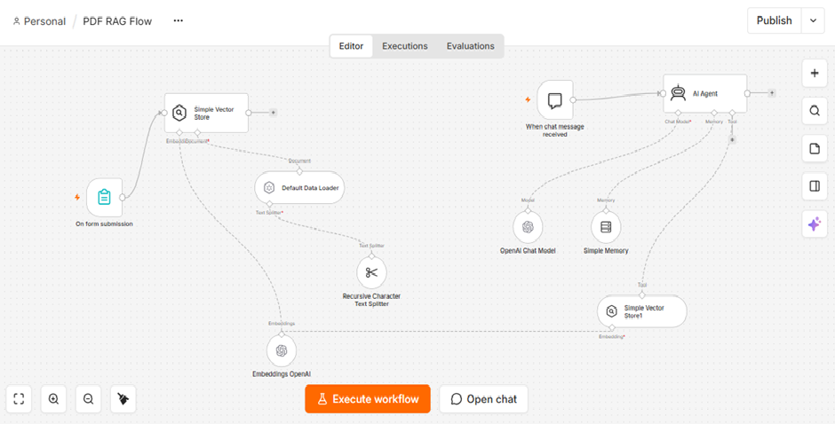
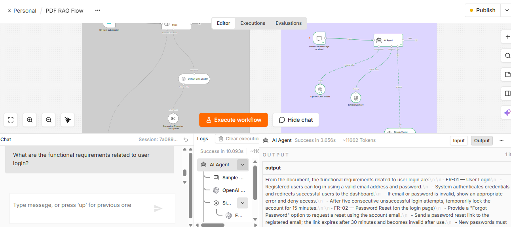
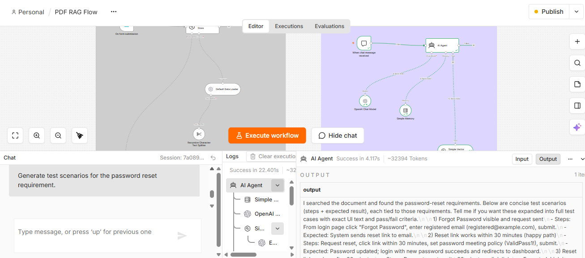

# PDF RAG Agent with n8n for AI-Powered Software Testing

A hands-on Retrieval-Augmented Generation (RAG) project built with n8n.

## 🎯 Project Overview

PDF
 ↓
Document Loader
 ↓
Text Splitter
 ↓
OpenAI Embeddings
 ↓
Vector Store
 ↓
Retriever
 ↓
AI Agent
 ↓
Grounded Answer

## 🔍 How It Works

### Document ingestion

PDF → Load → Split → Embed → Store

### Question answering

Question → AI Agent → Retrieve relevant content → Grounded response

## 🔄 n8n Workflow

The following workflow demonstrates the complete PDF ingestion and RAG-based question-answering flow.

## 🧪 QA Demonstration

This project demonstrates how a PDF-based RAG Agent can support common Software Testing activities by retrieving relevant requirements and generating grounded QA outputs.

### Use Case 1 — Requirement Analysis

**Question:**

> What are the functional requirements related to user login?

**RAG Agent Output:**

The agent retrieves the relevant user-login requirements from the uploaded SRS and provides a concise requirement summary.

---

### Use Case 2 — Test Scenario Generation

**Question:**

> Generate test scenarios for the password reset requirement.

**RAG Agent Output:**

The agent retrieves the password-reset requirements and generates test scenarios containing test steps and expected results.

> **Note:** These examples demonstrate the intended QA use cases. Actual answers depend on the content of the PDF provided to the workflow.

### QA Value Demonstrated

- Requirement understanding from SRS documents
- Retrieval of relevant requirement content
- AI-assisted test scenario generation
- Test steps and expected-result generation
- Document-grounded responses using RAG
- AI Agent orchestration using n8n

## 🧪 Software Testing Use Cases

- Requirements → Test Scenarios
- BRDs → Test Cases
- API Documentation → API Test Ideas
- Defect History → Defect Analysis
- Release Notes → Regression Testing

## 🛠️ Technology

- n8n
- Retrieval-Augmented Generation (RAG)
- OpenAI embeddings
- Vector Store
- AI Agent
- Conversational Memory

## 🔐 Security

This repository contains a sanitized workflow.

No API keys, passwords, private documents, or production credentials are included.

## ⚠️ Demo / Learning Project

The workflow uses an in-memory vector store and is intended as a hands-on proof of concept and learning project rather than a production deployment.

## 👩‍💻 Author

Lipika Chaliha

AI-Driven QA Test Lead | Software Testing | AI Agent Development with n8n
